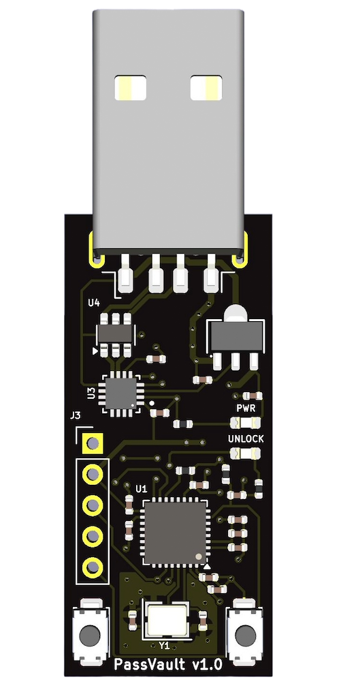

# TOTPVault

TOTPVault is a secure hardware vault for storing TOTP codes for two-factor authentication. It is compatible with websites and applications which support authenticators such as Google Authenticator or Authy.

TOTPVault uses an RISC-V ESP32-C3 microcontroller to perform cryptographic operations and storage/generation of TOTP codes with a separate chip to run an isolated USB stack.

<p align="center">
    
</p>

## Demo


## Features

- Support for up to 64 credentials
- Cross platform, no drivers needed for Linux/MacOS
- Open source firmware, software, and hardware!

### Security Features (summary)
- TOTP secrets stored with AES256, decryption key derived from vault password via PBKDF2
- Trusted firmware via secure boot with attestation available
- ESP32-C3 HW RNG used for cryptographic operations
- USB stack isolated to separate chip to minimize attack surface
- Hardware locked down (JTAG disabled, eFuses set, etc)

# System Architecture
[System Architecture](https://gfoudree.github.io/TOTPVault/system-design/)

## Installation

First, clone the repository and build the `totpvault-cli` tool and build it:

```bash
git clone https://github.com/gfoudree/totpvault
cd totpvault/totpvault-cli
cargo build -r
```

The CLI program will be located at: `target/release/totpvault-cli`
## Documentation

[Documentation](https://gfoudree.github.io/TOTPVault/)

# FAQ

#### Why choose ESP32-C3 for the microcontroller?
The ESP32 chips have strong hardware security features such as HWRNG, encryption/hashing support, secure boot, and encrypted flash.

Other chips have some or all of these features, however the ESP32-C3 is [PSA-L1 certified](https://products.psacertified.org/products/esp32-c3-series/certificates#security-level-1), has good support for Rust firmware, and is affordable.

#### The ESP32 has Wifi/Bluetooth, does this device use either?
No, there is no antenna on the board and the Wifi/Bluetooth stack is disabled in the firmware.

#### If somebody steals my device, can they generate TOTP codes for my accounts?
No, as long as your password is strong they cannot unlock the vault and generate codes.

## Authors

- [@gfoudree](https://www.github.com/gfoudree)


## License

[GNU GPLv3](https://choosealicense.com/licenses/gpl-3.0/)

