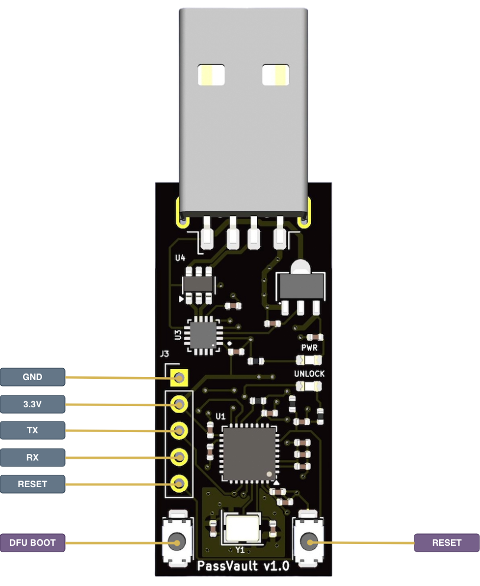

# Hardware Overview

The TOTPVault device is designed with a focus on security and simplicity. Below is a detailed overview of its components and design.

## Specifications

*   **Secure Processor**: ESP32-C3
    *   4MB Flash Storage
*   **USB-to-UART Adapter**: CH343P
*   **USB Connector**: USB-A
*   **Protection**: TVS Diode for static discharge protection on USB lines
*   **Debug Interface**: 5-pin header
    *   TX/RX (serial communication)
    *   3.3V Power
    *   Ground
    *   DFU mode pin
*   **Physical Buttons**:
    *   Reset button
    *   DFU mode button
