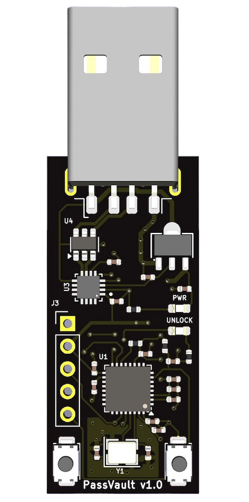

# Introduction

# TOTPVault

TOTPVault is a secure hardware vault for storing TOTP codes for two-factor authentication. It is compatible with websites and applications which support authenticators such as Google Authenticator or Authy.

For a detailed look at the hardware components, see the [Hardware Overview](hardware.md).

# Websites Tested
TOTPVault should work on almost all TOTP-based authentication sites, the list below shows which ones have been validated to be working

| Website       | Supported |
|---------------|-----------|
| Google        |     Y     |
| Digital Ocean |     Y     |
| Amazon        |     Y     |
| Microsoft     |     Y     |
| Instagram     |     Y     |
| Paypal        |     Y     |
| eBay          |     Y     |
| Cloudflare    |     Y     |
| Dropbox       |     Y     |
| Github        |     Y     |
| Gitlab        |     Y     |
| Linkedin      |     Y     |
| Protonmail    |     Y     |

# FAQ
### Why choose ESP32-C3 for the microcontroller?
The ESP32 chips have strong hardware security features such as HWRNG, encryption/hashing support, secure boot, and encrypted flash.

Other chips have some or all of these features, however the ESP32-C3 is [PSA-L1 certified](https://products.psacertified.org/products/esp32-c3-series/certificates#security-level-1), has good support for Rust firmware, and is affordable.

### The ESP32 has Wifi/Bluetooth, does this device use either?
No, there is no antenna on the board and the Wifi/Bluetooth stack is disabled in the firmware.

### If somebody steals my device, can they generate TOTP codes for my accounts?
No, as long as your password is strong they cannot unlock the vault and generate codes.

# Troubleshooting
### Device does not show up
Try reinserting the device and look for a USB device with the VID 0x1A86 and PID 0x55D3. 

You can run `dev-info -v` which will print verbose output as to how the device is selected. It is possible another device exists with the same VID/PID in which case use `-p` to specify the path to the exact device
